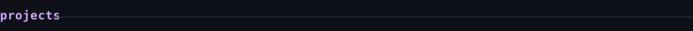
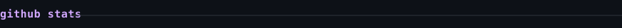
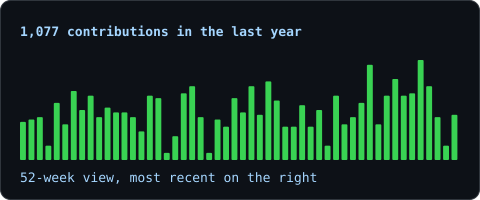
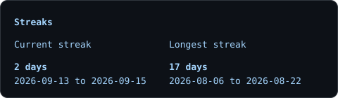
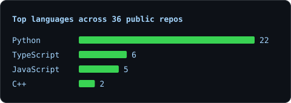
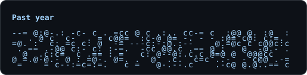

  <picture>
    <source media="(prefers-color-scheme: dark)" srcset="portrait-dark.svg">
    <source media="(prefers-color-scheme: light)" srcset="portrait-light.svg">
    
  </picture>

  <a href="https://amrita-kadam.vercel.app/">portfolio</a> ·
  <a href="https://www.linkedin.com/in/amrita-kadam-2a293b287">linkedin</a> ·
  <a href="mailto:amrita0205kadam@gmail.com">email</a>

  <samp>AI/ML · LLM Reliability · Interpretability · Agentic Systems · Full-Stack ML</samp>

I build AI systems end to end — then measure where they fail.

Currently exploring mechanistic interpretability, hallucination detection,
retrieval, multi-agent workflows, and production ML.

 

<picture>
  <source media="(prefers-color-scheme: dark)" srcset="heading-projects-dark.svg">
  <source media="(prefers-color-scheme: light)" srcset="heading-projects-light.svg">
  
</picture>

Veda AI

Assessment extraction and answer mapping

A deployed vision-LLM pipeline that takes a printed question paper and handwritten answer sheet, extracts questions and answers, maps answers even when written out of order, tightens highlights onto the actual ink, and grades the submission.

<samp>Next.js · TypeScript · FastAPI · Python · Gemini Vision · NumPy · Pillow</samp>

<a href="https://github.com/Amrita0205/Extraction-and-Answer-Mapping-Veda-AI">repo</a> ·
<a href="https://extraction-and-answer-mapping-veda-nine.vercel.app">live app</a>

GhostRead

A transparent, always-on-top PDF reader

A free, open-source reader for Windows, Linux and macOS. The Windows build adds click-through and ghost mode so a textbook can stay over a terminal or editor without becoming unreadable. The project ships a Windows executable, PyPI package, tests, and GitHub Actions automation.

<samp>Python · Tkinter · PyMuPDF · ctypes · GitHub Actions · PyPI</samp>

<a href="https://github.com/Amrita0205/ghostreader">repo</a> ·
<a href="https://pypi.org/project/ghostread/">PyPI</a>

Agentic AI Career Advisor

Team-built multi-agent career system

A LangGraph workflow with specialised agents for job-market analysis, resume optimisation, skill-gap detection, and mock interviewing, grounded with ChromaDB and Gemma embeddings.

<samp>LangGraph · RAG · ChromaDB · Gemma · Python</samp>

<a href="https://github.com/anandn1/career-advisor">team repo</a> ·
<a href="https://youtu.be/56Xtd1PNetw">demo</a>

Blog Writing Crew

Research → writing → editing → social

A four-agent CrewAI pipeline powered by Groq and llama-3.3-70b-versatile, producing a final blog post plus Twitter/X and LinkedIn variants.

<samp>CrewAI · Groq · Llama 3.3 · Python</samp>

<a href="https://github.com/Amrita0205/Blog_writing_AI_agent">repo</a>

Local RAG API

Fully offline retrieval-augmented QA

A local RAG service built around FastAPI, ChromaDB and Ollama. Queries retrieve semantic context, augment the prompt, and generate an answer locally with no external API calls.

<samp>FastAPI · ChromaDB · Ollama · embeddings · RAG</samp>

<a href="https://github.com/Amrita0205/Multi-user_AI_Directory_RAG_Ollama">repo</a>

Iris Prediction API

A small end-to-end MLOps system

MLflow tracks experiments and registers the best model; FastAPI serves the registered classifier through a REST endpoint. The repository includes solver comparisons and reported 97.5% test accuracy for the lbfgs run.

<samp>MLflow · scikit-learn · FastAPI · REST · Python</samp>

<a href="https://github.com/Amrita0205/MLops_prediction_iris_dataset">repo</a>

 

<picture>
  <source media="(prefers-color-scheme: dark)" srcset="heading-research-dark.svg">
  <source media="(prefers-color-scheme: light)" srcset="heading-research-light.svg">
  
</picture>

Moleculyst — Machine Learning Research Intern

Working on LLM reliability and interpretability: probing residual-stream activations of frozen Gemma models, building reproducible activation extraction/caching pipelines, and designing causal validation experiments with steering vectors and attention-head ablation.

<samp>PyTorch · TransformerLens · Gemma Scope · activation analysis · causal experiments</samp>

 

<picture>
  <source media="(prefers-color-scheme: dark)" srcset="heading-stats-heading-dark.svg">
  <source media="(prefers-color-scheme: light)" srcset="heading-stats-heading-light.svg">
  
</picture>

  <picture>
    <source media="(prefers-color-scheme: dark)" srcset="stats-dark.svg">
    <source media="(prefers-color-scheme: light)" srcset="stats-light.svg">
    
  </picture>
  <picture>
    <source media="(prefers-color-scheme: dark)" srcset="streak-dark.svg">
    <source media="(prefers-color-scheme: light)" srcset="streak-light.svg">
    
  </picture>

  <picture>
    <source media="(prefers-color-scheme: dark)" srcset="langs-dark.svg">
    <source media="(prefers-color-scheme: light)" srcset="langs-light.svg">
    
  </picture>
  <picture>
    <source media="(prefers-color-scheme: dark)" srcset="year-dark.svg">
    <source media="(prefers-color-scheme: light)" srcset="year-light.svg">
    
  </picture>

 

<picture>
  <source media="(prefers-color-scheme: dark)" srcset="heading-contact-dark.svg">
  <source media="(prefers-color-scheme: light)" srcset="heading-contact-light.svg">
  
</picture>

<samp>
Email&nbsp;&nbsp;&nbsp;&nbsp;amrita0205kadam@gmail.com 
LinkedIn&nbsp;&nbsp;linkedin.com/in/amrita-kadam-2a293b287 
Portfolio&nbsp;amrita-kadam.vercel.app 
GitHub&nbsp;&nbsp;&nbsp;github.com/Amrita0205
</samp>

 

  <a href="https://github.com/Amrita0205?tab=repositories">all repositories</a>

B.Tech CSE · IIIT Raichur · expected 2027 · Summer of Bitcoin 2026 · Tech Coordinator, CodeSoc
