<a href="https://amrita-kadam.vercel.app/">portfolio</a> &nbsp;·&nbsp;
<a href="https://www.linkedin.com/in/amrita-kadam-2a293b287">linkedin</a> &nbsp;·&nbsp;
<a href="mailto:amrita0205kadam@gmail.com">email</a>

> B.Tech CSE student at IIIT Raichur, building AI/ML systems around LLMs, 
> retrieval, agentic workflows, and mechanistic interpretability. 
> I build things end to end — then test where they fail.

Right now I'm exploring LLM reliability and interpretability while building 
practical RAG and multi-agent systems. I care about both model internals 
and the engineering needed to turn an experiment into a usable product.

<samp>python &nbsp; pytorch &nbsp; transformerLens &nbsp; gemma scope &nbsp; langgraph &nbsp; crewai &nbsp; langchain &nbsp; rag &nbsp; chromadb &nbsp; ollama &nbsp; fastapi &nbsp; mlflow &nbsp; next.js &nbsp; typescript &nbsp; postgres &nbsp; git &nbsp; linux</samp>

**[Veda AI](https://github.com/Amrita0205/Extraction-and-Answer-Mapping-Veda-AI)** &nbsp;·&nbsp; <samp>next.js, fastapi, gemini vision</samp> 
Question paper in, handwritten answer sheet in. Extracts questions and answers, 
maps out-of-order answers, tightens highlights onto actual ink, and grades. 
[repo](https://github.com/Amrita0205/Extraction-and-Answer-Mapping-Veda-AI) &nbsp;·&nbsp;
[live app](https://extraction-and-answer-mapping-veda-nine.vercel.app)

**[GhostRead](https://github.com/Amrita0205/ghostreader)** &nbsp;·&nbsp; <samp>python, tkinter, pymupdf</samp> 
Transparent always-on-top PDF reader with Windows click-through and ghost mode. 
Ships a Windows executable, PyPI package, tests, releases, and CI. 
[repo](https://github.com/Amrita0205/ghostreader) &nbsp;·&nbsp;
[PyPI](https://pypi.org/project/ghostread/)

**[Agentic AI Career Advisor](https://github.com/anandn1/career-advisor)** &nbsp;·&nbsp; <samp>langgraph, chromadb, rag</samp> 
Team-built multi-agent career system for job analysis, resume optimisation, 
skill-gap detection, and mock interviewing, grounded with ChromaDB. 
[team repo](https://github.com/anandn1/career-advisor) &nbsp;·&nbsp;
[demo](https://youtu.be/56Xtd1PNetw)

**[Blog Writing Crew](https://github.com/Amrita0205/Blog_writing_AI_agent)** &nbsp;·&nbsp; <samp>crewai, groq</samp> 
Four agents research, write, edit, and turn the result into Twitter/X and 
LinkedIn content.

> Part-time model debugger, full-time space daydreamer.

By day I open up language models to see what's going on in there: 
which features light up, which neurons fire, and why a model can 
be so confident and so wrong at the same time. The dream is models 
we can actually read, not just run and hope.

By night I'm usually thinking about space. Somewhere out there a 
star is being born, another is quietly collapsing, and a planet 
nobody has named yet is doing laps around both. It's oddly calming. 
The universe ships things half-finished and figures it out later too.

Turns out it's the same hobby twice: staring at something huge and 
complicated and asking "okay, but what's happening inside?"

The rest of the time I'm dancing, singing, or drawing. 
None of them professionally. All of them with full commitment.

<samp>currently: interpreting transformers &nbsp;·&nbsp; wondering about dying stars &nbsp;·&nbsp; doodling in margins</samp>

<a href="https://github.com/Amrita0205?tab=repositories">all repositories →</a>

