<a href="https://amrita-kadam.vercel.app/">portfolio</a> &nbsp;·&nbsp;
<a href="https://www.linkedin.com/in/amrita-kadam-2a293b287">linkedin</a> &nbsp;·&nbsp;
<a href="mailto:amrita0205kadam@gmail.com">email</a>

> B.Tech CSE student at IIIT Raichur, building AI/ML systems around LLMs, 
> retrieval, agentic workflows, and mechanistic interpretability. 
> I build things end to end — then test where they fail.

Right now I'm exploring LLM reliability and interpretability while building 
practical RAG and multi-agent systems. I care about both model internals 
and the engineering needed to turn an experiment into a usable product.

<samp>python &nbsp; pytorch &nbsp; transformerLens &nbsp; gemma scope &nbsp; langgraph &nbsp; crewai &nbsp; langchain &nbsp; rag &nbsp; chromadb &nbsp; ollama &nbsp; fastapi &nbsp; mlflow &nbsp; next.js &nbsp; typescript &nbsp; postgres &nbsp; git &nbsp; linux</samp>

**[Veda AI](https://github.com/Amrita0205/Extraction-and-Answer-Mapping-Veda-AI)** &nbsp;·&nbsp; <samp>next.js, fastapi, gemini vision</samp> 
Question paper in, handwritten answer sheet out. Extracts questions and answers, 
maps out-of-order answers, tightens highlights onto actual ink, and grades. 
[repo](https://github.com/Amrita0205/Extraction-and-Answer-Mapping-Veda-AI) &nbsp;·&nbsp;
[live app](https://extraction-and-answer-mapping-veda-nine.vercel.app)

**[GhostRead](https://github.com/Amrita0205/ghostreader)** &nbsp;·&nbsp; <samp>python, tkinter, pymupdf</samp> 
Transparent always-on-top PDF reader with Windows click-through and ghost mode. 
Ships a Windows executable, PyPI package, tests, releases, and CI. 
[repo](https://github.com/Amrita0205/ghostreader) &nbsp;·&nbsp;
[PyPI](https://pypi.org/project/ghostread/)

**[Agentic AI Career Advisor](https://github.com/anandn1/career-advisor)** &nbsp;·&nbsp; <samp>langgraph, chromadb, rag</samp> 
Team-built multi-agent career system for job analysis, resume optimisation, 
skill-gap detection, and mock interviewing, grounded with ChromaDB. 
[team repo](https://github.com/anandn1/career-advisor) &nbsp;·&nbsp;
[demo](https://youtu.be/56Xtd1PNetw)

**[Blog Writing Crew](https://github.com/Amrita0205/Blog_writing_AI_agent)** &nbsp;·&nbsp; <samp>crewai, groq</samp> 
Four agents research, write, edit, and turn the result into Twitter/X and 
LinkedIn content.

Every graphic here lives in this repository rather than loading from a third-party 
stats service. The portrait and section headings are local SVGs, and the contribution 
graphics are local SVG snapshots kept alongside this README.

The layout follows the same constraints as the reference design: custom typography 
lives in images, body text stays native to GitHub, and <samp> keeps project metadata 
monospace without turning the page into a wall of badges.

<a href="https://github.com/Amrita0205?tab=repositories">all repositories →</a>

